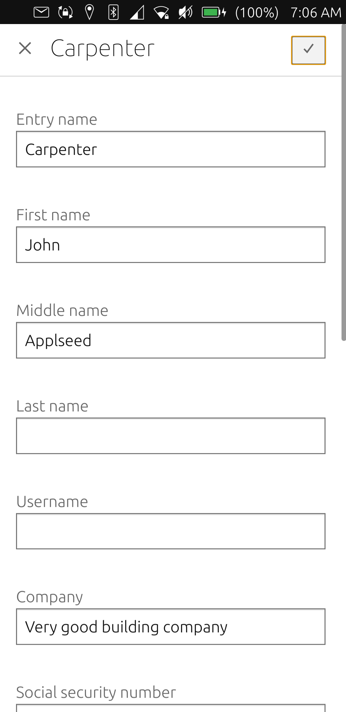

  

<h1 align="center">Warden</h1>

  

  
  
  
  
  

Warden is a [Bitwarden](https://bitwarden.com)/[Vaultwarden](https://github.com/dani-garcia/vaultwarden) client for [Ubuntu Touch](https://ubuntu-touch.io).

## Features

1. View and edit: passwords, contact, secure notes and credit cards
2. Generate passwords

## Porting

Although Warden is intended for ubuntu touch it is written completely in web technologies. This means that, if there is demand, the app can be ported to virtually any platform. The biggest problem will be [CORS](https://developer.mozilla.org/en-US/docs/Web/HTTP/CORS).
